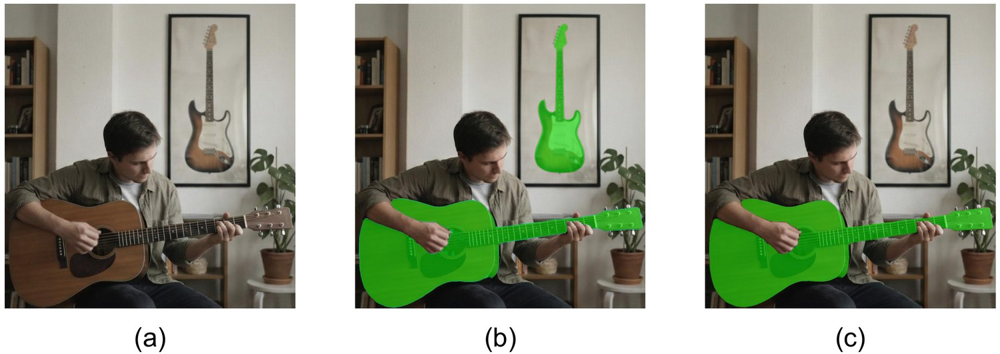
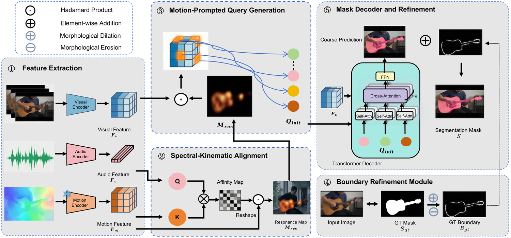
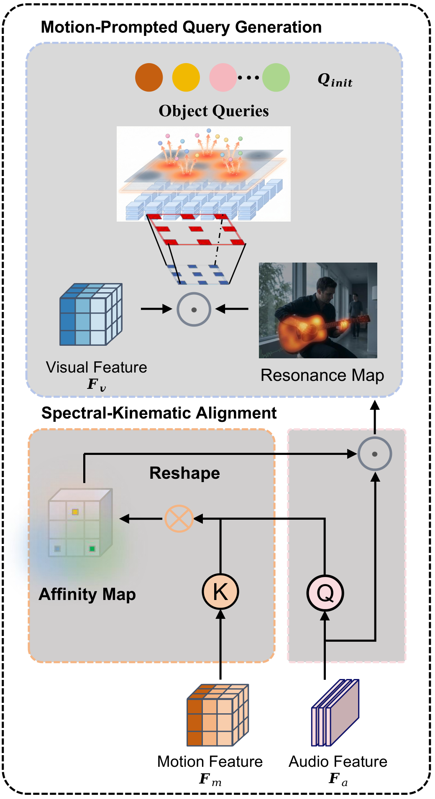
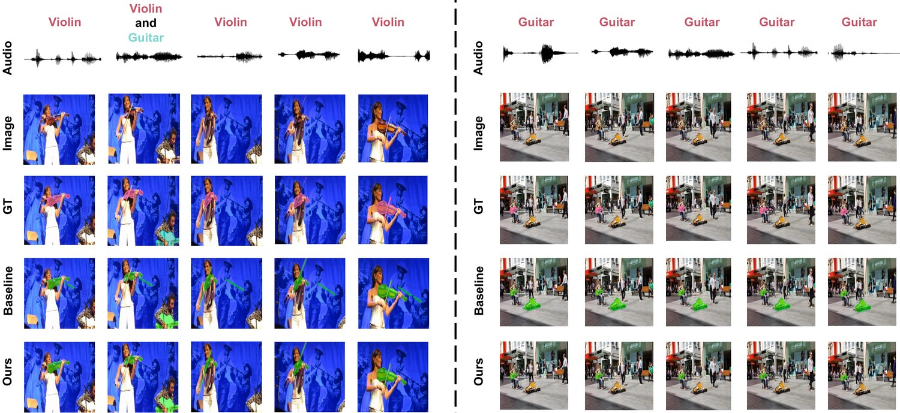

<div align="center">

# Listening to the Motion

### Audio-Conditioned Kinematic Verification for Robust Audio-Visual Segmentation

[](#installation)
[](#installation)
[](#installation)
[](#overview)
[](#main-results)
[](#citation)
[](LICENSE)

**KEVA — a verification-first framework that asks whether observed motion is compatible with the soundtrack before it is allowed to drive segmentation.**

</div>

<p align="center">
  
</p>

<p align="center">
<em><b>(a)</b> AVS localizes sounding objects. <b>(b)</b> A vision-centric baseline selects a <b>silent poster</b> under static visual bias.
<b>(c)</b> KEVA uses audio–motion alignment to recover the real sound source with a complete contour, under competing saliency.</em>
</p>

## Overview

Audio-Visual Segmentation (AVS) requires pixel-level localization of the objects that are actually *making sound*. The recent vision-centric paradigm sharpened boundaries, but it inherited a structural weakness: it leans on **static visual saliency**, so a silent guitar on a poster can outvote the guitar being played.

The obvious fix — throwing optical flow into the model — does not work either. Raw flow carries camera shake, background movement, and unrelated dynamics, so naive motion fusion trades one distractor for another.

**KEVA** (Kinematic Evidence Verification for AVS) treats motion as *evidence to be verified rather than a feature to be fused*. Audio does not merely condition the decoder; it interrogates the kinematic field and decides which motion is admissible in the first place.

| Module | Role |
| --- | --- |
| **SKA** — Spectral–Kinematic Alignment | Projects audio to a query and the motion field to keys, producing an audio–motion affinity that gates flow into a **resonance map**. Motion uncorrelated with the soundtrack is suppressed before localization. |
| **MPQG** — Motion-Prompted Query Generation | Uses the resonance map to modulate visual features through a **zero-initialized residual gate**, then samples object queries from verified locations rather than merely salient ones. |
| **BRM** — Boundary Refinement Module | Recovers pixel-accurate contours from high-frequency pixel embeddings, supervised by a morphological boundary target. |

The zero-initialized gate matters: when a source is stationary and motion evidence is weak or absent, the model degrades gracefully to the appearance-based prior instead of hallucinating kinematics.

## Method

<p align="center">
  
</p>

<p align="center">
<em>Five stages: (1) feature extraction yields visual, audio, and motion features; (2) SKA filters the motion field with audio to form the resonance map;
(3) MPQG modulates visual features and samples queries from verified locations; (4) BRM predicts contours from pixel features; (5) the decoder fuses coarse masks with contours.</em>
</p>

<details>
<summary><b>SKA and MPQG in detail</b></summary>

<p align="center">
  
</p>

SKA correlates the pooled audio query with kinematic keys by spatial affinity to produce the resonance map. Because the softmax is taken over spatial locations, candidate motions compete on *audio compatibility* rather than flow magnitude. MPQG then uses that map to modulate visual features and rank anchors; weak responses retain visual content instead of being erased.

</details>

## Main Results

All rows use a Swin-B backbone. KEVA reports the five-seed mean under the matched training protocol.

### AVSBench

*mIoU = mean Jaccard index (M_J); F-score = mean F-measure (M_F). Best in **bold**, second best <ins>underlined</ins> within the listed comparison set.*

| Method | Venue | S4 mIoU | S4 F-score | MS3 mIoU | MS3 F-score | AVSS mIoU | AVSS F-score |
| --- | --- | --- | --- | --- | --- | --- | --- |
| CPM | ECCV'24 | 81.40 | 90.50 | 59.80 | 71.00 | 34.50 | 39.60 |
| TeSO | ECCV'24 | 83.30 | 93.30 | 66.00 | 80.10 | 39.00 | 45.10 |
| AVSBias | MM'24 | 83.30 | 93.00 | 67.20 | 80.80 | 44.40 | 49.90 |
| ICF | ICCV'25 | <ins>86.63</ins> | <ins>93.51</ins> | 64.38 | 75.39 | 45.03 | 51.28 |
| SSP | ICCV'25 | 85.40 | 93.30 | <ins>72.30</ins> | <ins>84.60</ins> | 50.10 | 54.50 |
| VCT | CVPR'25 | 86.20 | 93.40 | 67.60 | 81.40 | <ins>51.20</ins> | <ins>55.50</ins> |
| **KEVA** | — | **87.42** | **95.10** | **73.50** | **84.88** | **51.98** | **56.33** |

The margin is largest on **MS3** (+5.90 mIoU over VCT), which is exactly the multi-source regime where several visible objects compete to explain one soundtrack — the case audio-conditioned verification is designed for.

### Matched functional attribution

Every row shares the same inputs, priors, decoder, optimization budget, and five paired seeds. Only the named operation changes.

| Configuration | S4 mIoU | MS3 mIoU | AVSS mIoU |
| --- | --- | --- | --- |
| VQR (vision-centric reference) | 86.20 | 67.60 | 51.20 |
| \+ Boundary refinement only | 86.55 | 68.30 | 51.45 |
| \+ Motion verification (SKA-gated PPQG) | 86.83 | 70.45 | 51.64 |
| \+ Verified querying (SKA + MPQG, no BRM) | 87.18 | 72.65 | 51.76 |
| **Full KEVA** | **87.42** | **73.50** | **51.98** |

Of the 5.90-point MS3 gain, **5.05 points come from the verification path** (SKA + MPQG); boundary refinement alone contributes 0.70. Refinement is complementary — it does not explain the localization gain.

### Robustness to deceptive saliency

A 98-video evaluation-only set covering moving silent distractors, camera motion, weak source motion, and correlated motion. *Drop* is measured against each method's own S4 score.

| Method | S4 mIoU | Custom mIoU | Drop ↓ |
| --- | --- | --- | --- |
| AVSegFormer | 82.10 | 68.45 | 13.65 |
| VCT | 86.20 | 75.30 | 10.90 |
| AVSBias | 83.30 | 75.80 | 7.50 |
| SSP | 85.40 | 79.10 | 6.30 |
| **KEVA** | **87.42** | **84.15** | **3.27** |

On AVSBench-Robust, G-mIoU rises from 23.79 → **42.00** (Robust-S4) and 47.91 → **61.00** (Robust-MS3).

## Qualitative Results

<p align="center">
  
</p>

<p align="center">
<em><b>Left:</b> KEVA tracks the active instrument and withholds masks from silent ones. <b>Right:</b> the baseline locks onto a salient silent object while KEVA follows the sounding performer across all frames.</em>
</p>

## Installation

```bash
git clone https://github.com/Jackey0903/SKA-VCT.git
cd SKA-VCT

conda create -n keva python=3.8 -y
conda activate keva

# Install PyTorch matching your CUDA version, then:
pip install -r requirements.txt

# Detectron2 is vendored in this repository
cd detectron2 && pip install -e . && cd ..
```

## Data Preparation

Download **AVSBench** (S4 / MS3 / AVSS) from the [official release](https://github.com/OpenNLPLab/AVSBench) and arrange it as:

```text
AVS_dataset/
  AVSBench_object/
    Single-source/          # S4
    Multi-sources/          # MS3
  AVSBench_semantic/        # AVSS
```

KEVA consumes a **precomputed kinematic field**, so run flow extraction once before training:

```bash
python avs_tools/compute_raft_flow.py \
    --dataset s4 --split train \
    --input_root  /path/to/AVS_dataset/AVSBench_object/Single-source \
    --output_root /path/to/AVS_dataset/raft_flow
```

Repeat with `--dataset ms3` / `--split test` as needed. Additional helpers live in `avs_tools/`:

| Script | Purpose |
| --- | --- |
| `compute_raft_flow.py` | Precompute RAFT optical flow (the kinematic field). |
| `generate_data_384/` | Resize frames and masks to the 384 training resolution. |
| `pre_mask/`, `pre_mask2rgb/` | Generate and convert Semantic-SAM priors. |
| `preprocess_avss_audio.py` | Prepare AVSS audio into log-mel spectrograms. |
| `convert-pretrained-swin-model-to-d2.py` | Convert Swin weights to Detectron2 format. |

## Training

Each subset has a ready-made script; pass the dataset root as the first argument.

```bash
# S4  (batch size 8, lr 2e-4)
bash scripts/s4_swinb_384_train_bs8_ama_brm.sh /path/to/AVSBench_object/Single-source/

# MS3
bash scripts/ms3_swinb_384_train_ama_brm.sh    /path/to/AVSBench_object/Multi-sources/

# AVSS
bash scripts/ss_swinb_384_train_ama_brm.sh     /path/to/AVSBench_semantic/
```

Equivalently, invoke the entrypoint directly. The two flags below switch the contributed modules on:

```bash
export DETECTRON2_DATASETS=/path/to/AVSBench_object/Single-source/

python train_net.py \
    --num-gpus 1 \
    --config-file configs/s4_swinb_384/COMBO_SWINB.yaml \
    SOLVER.IMS_PER_BATCH 8 \
    SOLVER.BASE_LR 0.0002 \
    SOLVER.AMP.ENABLED True \
    MODEL.SWIN.USE_CHECKPOINT True \
    MODEL.MASK_FORMER.USE_AMA True \
    MODEL.MASK_FORMER.USE_BOUNDARY_REFINEMENT True \
    OUTPUT_DIR output/s4_swinb_384_bs8_ama_brm
```

> `USE_AMA` enables the audio-conditioned verification path (SKA + MPQG); `USE_BOUNDARY_REFINEMENT` enables BRM.
> Learning rate follows square-root batch scaling: `bs 2 → 1e-4`, `bs 4 → 1.4e-4`, `bs 8 → 2e-4`.

## Evaluation

```bash
bash scripts/s4_swinb_384_test_bs8_ama_brm.sh  /path/to/checkpoint.pth
bash scripts/ms3_swinb_384_test_ama_brm.sh     /path/to/checkpoint.pth
bash scripts/ss_swinb_384_test_ama_brm.sh      /path/to/checkpoint.pth
```

Or directly:

```bash
python pred.py \
    --num-gpus 1 \
    --config-file configs/ms3_swinb_384/Test_COMBO_SWINB.yaml \
    --eval-only --ckpt /path/to/checkpoint.pth \
    MODEL.MASK_FORMER.USE_AMA True \
    MODEL.MASK_FORMER.USE_BOUNDARY_REFINEMENT True
```

`test_motion_guided.py` runs the motion-verification diagnostics, and `scripts/visualize_query_comparison.sh` reproduces the initial-query activation maps.

## Efficiency

Verification is cheap. Over the vision-centric baseline, KEVA adds **5.8M parameters** and **25.5 GFLOPs**. With flow cached, the core model runs at **18 FPS** (8.5 FPS end-to-end including RAFT extraction).

## Repository Structure

| Path | Description |
| --- | --- |
| `train_net.py` | Training entrypoint. |
| `pred.py` | Evaluation and prediction entrypoint. |
| `test_motion_guided.py` | Motion-verification diagnostics. |
| `configs/` | Per-subset configs (`s4_/ms3_/ss_swinb_384`). |
| `scripts/` | Ready-made training and evaluation scripts. |
| `avs_tools/` | Flow extraction, mask priors, and audio preprocessing. |
| `detectron2/` | Vendored Detectron2. |
| `assets/` | Figures used in this README. |

## TODO

- [x] Core model code and training/evaluation scripts
- [x] Flow extraction and preprocessing tools
- [ ] Pretrained checkpoints
- [ ] Custom-Distractor evaluation set release
- [ ] Paper link and final BibTeX

## Citation

The paper is under review. The final BibTeX will be updated once public metadata is available.

```bibtex
@misc{keva_listening_to_the_motion,
  title  = {Listening to the Motion: Audio-Conditioned Kinematic Verification
            for Robust Audio-Visual Segmentation},
  year   = {2026},
  note   = {Under review}
}
```

## Acknowledgement

This codebase builds on [VCT_AVS](https://github.com/spyflying/VCT_AVS) and [COMBO-AVS](https://github.com/yannqi/COMBO-AVS), with optical flow from [RAFT](https://github.com/princeton-vl/RAFT) and mask priors from [Semantic-SAM](https://github.com/UX-Decoder/Semantic-SAM). We thank the authors for releasing their work.
